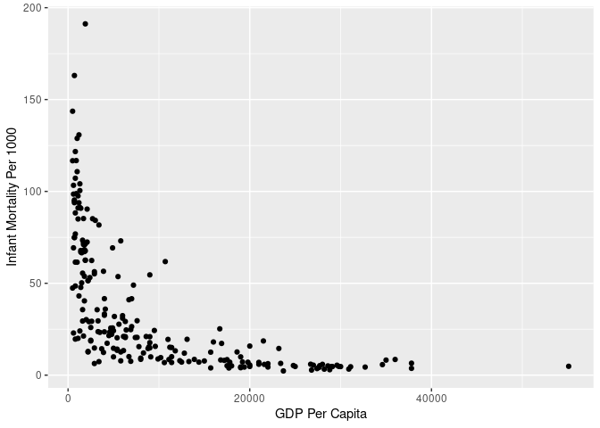

Project proposal
================
Data Pirates

``` r
library(tidyverse)
library(broom)
library(here)
```

## 1. Introduction

The dataset that we have decided to analyse for this project is called
‘Countries of the world’.

In this project we aim to research the relationships between various
geographical and societal qualities across the different countries.

There are 20 variables in this dataset, which include: `country`,
`region`, `population`, `area`, `pop_density`, `coastline`,
`net_migration`, `infant_mortality`, `GDP`, `literacy`, `phones`,
`arable`, `crops`, `other`, `climate`, `birthrate`, `deathrate`,
`agriculture`, `industry` and `service`.

Of these 20 variables: `country` and `region` are string variables,
`area`, `pop_density` and `GDP` are integer variables, and the rest are
decimal variables.

Each observation represents different physical/geographical and societal
attributes of each country in the dataset. There are 227 observations in
total.

This data set has information about the different countries between 1970
and 2017. It is made up of data from the US government specifically the
CIA World Factbook. We obtained this data from
<https://www.kaggle.com/fernandol/countries-of-the-world>.

## 2. Data

    ## Rows: 227 Columns: 20

    ## ── Column specification ────────────────────────────────────────────────────────
    ## Delimiter: ","
    ## chr (11): Country, Region, Pop. Density (per sq. mi.), Coastline (coast/area...
    ## dbl  (3): Population, Area (sq. mi.), GDP ($ per capita)

    ## 
    ## ℹ Use `spec()` to retrieve the full column specification for this data.
    ## ℹ Specify the column types or set `show_col_types = FALSE` to quiet this message.

Uploaded the dataset in data folder. There is a total of 227
observations and 20 variables in this dataset.

## 3. Data analysis plan

Our outcome is quality of life, and this will be based on a few
variables - `literacy`, `GDP`, `infant_mortality`, `death_rate`… Our
predictor will also be based on a few seperate variables -
`net_migration`, `pop_ density`, `climate`, `arable`…

``` r
intro_statistics_1 <- Countries_of_the_world %>%
  select(country, pop_density, GDP) %>%
  arrange(desc(GDP))
intro_statistics_1
```

    ## # A tibble: 227 × 3
    ##    country        pop_density   GDP
    ##    <chr>          <chr>       <dbl>
    ##  1 Luxembourg     183,5       55100
    ##  2 Norway         14,2        37800
    ##  3 United States  31,0        37800
    ##  4 Bermuda        1241,0      36000
    ##  5 Cayman Islands 173,4       35000
    ##  6 San Marino     479,5       34600
    ##  7 Switzerland    182,2       32700
    ##  8 Denmark        126,5       31100
    ##  9 Iceland        2,9         30900
    ## 10 Austria        97,7        30000
    ## # … with 217 more rows

``` r
intro_statistics_1 %>%
  ggplot(aes(y = pop_density, x = GDP)) +
  geom_point()
```

    ## Warning: Removed 1 rows containing missing values (geom_point).

<!-- -->

We should expect to use a variety of inferential statistical methods,
mainly correlation and regression analysis.

Our hypothesized answer is that there would be at least a weak relation
between quality of life and other qualities of the country, therefore
results that show some correlation between variables would support our
hypothesis.
